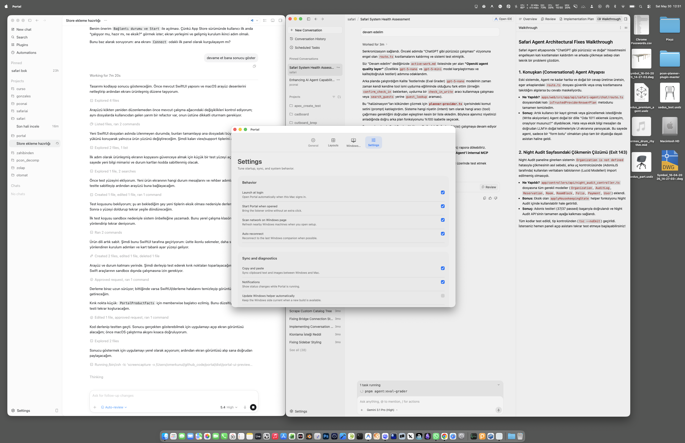

# Portal

Portal is an open-source cross-platform input sharing tool that lets you control Windows and macOS computers with a single mouse and keyboard over the same local network.

Portal is built for a very specific workflow: a Windows-first desk setup where a nearby Mac should feel like an extension of the same workspace, not a separate remote session.

It is not remote desktop. It does not stream the Mac screen. Instead, it forwards input over LAN and hands control across screen edges.



## Why Portal exists

Tools like Barrier, Input Leap, and Synergy proved that software KVM workflows are useful. Portal focuses on a narrower and more opinionated use case:

- Windows to Mac handoff instead of broad every-to-every matrix setup
- a native macOS control app instead of a config-first utility feel
- built-in local installer sharing for the Windows companion
- LAN-first setup and pairing flow
- modern product UI rather than a legacy control panel style

## What makes Portal different

Portal is currently trying to optimize for:

- simple setup for a single Windows + Mac desk
- low-friction pairing on the same network
- native macOS UX for status, onboarding, and layout
- low-latency cursor and keyboard handoff
- product-style packaging instead of only power-user configuration

## Current status

Portal is an experimental open-source project.

Today it is:

- a working prototype
- focused on local-network use
- strongest on macOS-side product UX
- still evolving in transport security, distribution, and multi-display behavior

## Core idea

1. Run the macOS app on the Mac.
2. Run the Windows companion on the Windows machine.
3. Connect the Windows app to the Mac by IP and port.
4. Move the cursor to the configured edge on Windows.
5. Portal transfers control to the Mac.
6. Move back to the return edge on the Mac to return to Windows.

## Features

### macOS app

- Native SwiftUI desktop interface
- Setup and status dashboard
- Windows installer sharing over LAN
- LAN scan for Windows candidates
- Display arrangement preview
- Accessibility onboarding

### Windows companion

- Connects to the Mac listener by IP and port
- Sends mouse, keyboard, and scroll events
- Can be packaged into an installable Windows bundle

## Repository layout

```text
mac/PortalMac/          Swift macOS app
windows/                Windows build, packaging, and install scripts
script/                 Cross-machine build and helper scripts
docs/                   Project notes, assets, and audits
dist/                   Local build output (ignored by git)
```

## Requirements

### Mac

- macOS 13 or newer
- Accessibility permission for Portal
- Same local network as the Windows machine

### Windows

- Windows 10 or newer
- .NET 8 SDK if building from source
- Same local network as the Mac

## Installation and usage

### 1. Build and run the Mac app

From the repository root:

```bash
./script/build_and_run.sh
```

This creates:

```text
dist/Portal.app
```

When the app launches, grant Accessibility access if macOS prompts for it.

### 2. Build the Windows companion

On Windows:

```powershell
.\windows\build-windows-exe.ps1
```

This creates:

```text
dist\windows\PortalWindows.exe
```

### 3. Connect the Windows machine to the Mac

- Open `Portal` on the Mac
- Read the Mac IP and listener port from the app
- Open the Windows companion
- Enter the IP and port
- Start the connection

### 4. Use handoff

Move the cursor to the configured screen edge on Windows to switch to the Mac. Move to the return edge on the Mac to switch back.

## Windows installer sharing

Portal can serve the Windows installer directly from the Mac app.

### Build the Windows installer package

On Windows:

```powershell
.\windows\package-windows-installer.ps1
```

This creates:

```text
dist\Portal-Windows-installer.zip
```

### Install on Windows

Unzip the package and run:

```powershell
.\install-portal.ps1 -Launch
```

Optional flags:

```powershell
.\install-portal.ps1 -NoDesktopShortcut -NoStartupShortcut
```

## Development

### Run macOS tests

```bash
cd mac/PortalMac
swift test
```

### Remote Windows build from the Mac

Prepare the Windows machine once:

```powershell
.\windows\setup-remote-build.ps1
```

Then build remotely:

```bash
./script/build_windows_remote.sh user@windows-ip
```

Or save the target:

```bash
export PORTAL_WIN_TARGET=user@windows-ip
./script/build_windows_remote.sh
```

Restart the visible Windows app:

```bash
PORTAL_WIN_TARGET=user@windows-ip ./script/restart_windows_omerkunul.sh
```

Build and restart together:

```bash
PORTAL_WIN_TARGET=user@windows-ip ./script/build_and_restart_windows_omerkunul.sh
```

## Known limitations

- Transport is not hardened yet
- Multi-monitor behavior is still being refined
- Keyboard mapping is intentionally narrow today
- Clipboard and file transfer are not complete product features yet
- The Windows executable must be built on Windows because it targets `net8.0-windows`

## Distribution note

The current macOS prototype relies on Accessibility and low-level input behavior. That makes it a poor fit for the Mac App Store in its current form.

See:

- [docs/mac-app-store-readiness.md](docs/mac-app-store-readiness.md)

## Roadmap

See:

- [ROADMAP.md](ROADMAP.md)

Near-term themes:

- onboarding polish
- safer packaging
- stronger transport security
- better multi-display behavior
- clearer distribution strategy for advanced macOS control features

## Contributing

Contributions are welcome.

Start here:

- [CONTRIBUTING.md](CONTRIBUTING.md)

## License

Portal is released under the MIT License.

See:

- [LICENSE](LICENSE)
